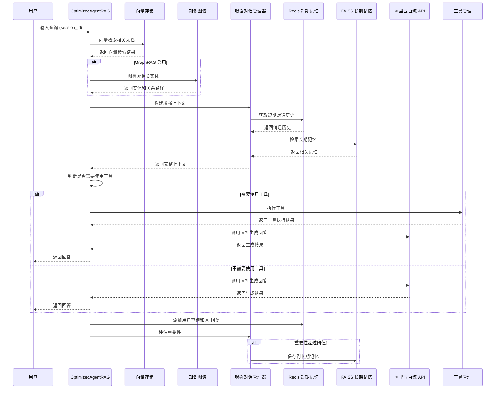

# 景明（Jingming） 游戏Agent系统 Code

## 1. 项目概览

景明Agent系统是一个基于 LangChain 和阿里云百炼 API 的《星露谷物语》知识库聊天机器人系统，采用 **混合 RAG 架构**，结合传统向量检索和知识图谱推理，将 Markdown 文件转换为向量数据库和知识图谱，结合阿里云百炼 API 生成高质量的回答。

### 核心功能
- ✅ 自然语言理解与处理
- ✅ 知识库管理与检索
- ✅ **GraphRAG 知识图谱增强** - 基于 Neo4j 的实体关系图谱
- ✅ **混合检索** - 向量检索 + 关键词检索 + 图检索
- ✅ **Redis 短期记忆** - 维护短期会话上下文
- ✅ **向量存储长期记忆** - 重要对话持久化存储
- ✅ 工具使用能力（8 种工具）
- ✅ 会话记忆和学习
- ✅ 自主决策
- ✅ 多跳关系推理能力

### 技术栈
- **编程语言**：Python 3.8+
- **核心框架**：LangChain
- **向量存储**：FAISS（本地）
- **知识图谱**：NetworkX + Neo4j（可选）
- **混合检索**：向量检索 + BM25 + GraphRAG
- **会话存储**：Redis（短期）+ FAISS（长期）
- **文本处理**：Markdown 解析器
- **API 服务**：阿里云百炼 API

---

## 2. 目录结构

```
agent-rag/
├── src/                   # 源代码
│   ├── api/                  # API 集成模块
│   ├── conversation/         # 对话管理模块
│   │   ├── conversation_manager.py         # 标准对话管理
│   │   └── enhanced_conversation_manager.py  # 增强对话管理（Redis + 长期记忆）
│   ├── document_processing/  # 文档处理模块
│   ├── graph/                # GraphRAG 模块 ✨ 新增
│   │   ├── __init__.py
│   │   ├── entity_extractor.py       # 实体抽取
│   │   ├── graph_builder.py         # 知识图谱构建
│   │   └── graph_retriever.py        # 图检索和推理
│   ├── tools/                # 工具使用模块
│   ├── vector_store/         # 向量存储模块
│   ├── utils/               # 工具函数
│   │   └── redis_manager.py         # Redis 连接管理 ✨ 新增
│   ├── main.py               # 主入口
│   └── main_optimized.py    # 优化版主入口（集成 GraphRAG + Redis）
├── data/                  # 数据目录
│   ├── knowledge/           # 知识库文件（星露谷物语 Markdown）
│   └── vector_db/           # 向量数据库
├── backend/               # FastAPI 后端服务
├── frontend/              # Vue 前端界面
├── config/                # 配置文件
├── docs/                  # 文档
├── tests/                 # 测试用例
│   ├── test_graphrag.py             # GraphRAG 单元测试
│   ├── test_graphrag_integration.py  # GraphRAG 集成测试
│   └── test_redis_integration.py     # Redis 集成测试
├── requirements.txt       # 依赖声明
├── README.md              # 项目说明（本文档）
└── 启动指南.md            # 启动指南
```

---

## 3. 系统架构

Agent RAG 系统采用模块化设计，各组件之间通过明确的接口进行交互。最新架构采用 **混合 RAG + 分层记忆** 设计：

1. **用户交互层**：处理用户输入和系统输出
2. **核心处理层**：包括对话管理、工具调用和决策逻辑
3. **检索增强层**：
   - 向量检索（FAISS）- 语义检索
   - 关键词检索（BM25）- 精确匹配
   - 图检索（GraphRAG）- 关系推理
4. **记忆分层**：
   - 短期记忆：Redis - 维护当前会话
   - 长期记忆：FAISS 向量存储 - 保存重要对话
5. **API 集成层**：与阿里云百炼 API 交互

### 架构流程图

```mermaid
flowchart TD
    User[用户] --> AgentRAG[OptimizedAgentRAG]
    AgentRAG --> MarkdownProcessor[文档处理模块]
    AgentRAG --> VectorStoreManager[向量存储模块]
    AgentRAG --> EnhancedConversationManager[增强对话管理器<br>(Redis 短期 + 向量长期)]
    AgentRAG --> GraphBuilder[知识图谱构建]
    AgentRAG --> GraphRetriever[图检索推理]
    AgentRAG --> BailianAPI[阿里云百炼 API]
    AgentRAG --> ToolManager[工具管理模块]
    
    MarkdownProcessor --> |处理Markdown文件| VectorStoreManager
    MarkdownProcessor --> |提取实体关系| GraphBuilder
    
    GraphBuilder --> |构建知识图谱| GraphRetriever
    VectorStoreManager --> |语义检索| AgentRAG
    GraphRetriever --> |关系推理<br>多跳查询| AgentRAG
    
    EnhancedConversationManager --> |Redis:短期记忆<br>向量:长期记忆| AgentRAG
    BailianAPI --> |生成回答| AgentRAG
    ToolManager --> |执行工具| AgentRAG
    
    AgentRAG --> |回复| User
```

---

## 4. 核心模块

### 4.1 主入口模块 (main_optimized.py)

优化版主入口 [main_optimized.py](src/main_optimized.py) 是系统的核心控制中心，支持 GraphRAG 和 Redis 增强功能。

**主要功能**：
- 加载环境变量和配置
- 初始化各模块（支持 GraphRAG + EnhancedConversation）
- 协调各模块的工作流程
- 处理用户查询并返回响应
- 支持 session_id 会话管理

**核心流程**：
1. 加载环境变量和配置
2. 初始化各模块实例
3. 初始化向量存储（如果不存在）
4. 初始化 GraphRAG（如果启用）
5. 处理用户查询（支持 session_id）
6. 混合检索：向量 + 图
7. 构建增强上下文
8. 生成回答
9. 保存到短期记忆 + 长期记忆（重要对话）

### 4.2 文档处理模块 (markdown_processor.py)

文档处理模块 [markdown_processor.py](src/document_processing/markdown_processor.py) 负责加载和处理 Markdown 文档。

**主要功能**：
- 加载知识库中的 Markdown 文件
- 将文档分割成合适的块
- 提取文档内容和元数据

### 4.3 向量存储模块 (vector_store.py)

向量存储模块 [vector_store.py](src/vector_store/vector_store.py) 负责管理向量数据库，包括文档向量化、存储和检索。

**主要功能**：
- 文档向量化
- 向量存储管理
- 相似性搜索
- 混合检索（向量 + BM25）
- `add_document()` - 添加单个文档到向量存储（支持长期记忆）
- 索引优化

### 4.4 对话管理模块

#### 标准对话管理 (conversation_manager.py)
标准对话管理模块 [conversation_manager.py](src/conversation/conversation_manager.py) 负责管理会话历史和构建上下文。

**主要功能**：
- 管理会话历史
- 构建上下文
- 提供会话记忆

#### 增强对话管理 (enhanced_conversation_manager.py) ✨ 新增
增强对话管理模块 [enhanced_conversation_manager.py](src/conversation/enhanced_conversation_manager.py) 支持 **分层记忆**：**Redis 短期记忆 + 向量长期记忆**。

**主要功能**：
- `create_session()` - 创建新会话
- `add_message()` - 添加消息到会话
- `get_context()` - 构建增强上下文（短期 + 长期 + 检索）
- `save_to_long_term_memory()` - 保存重要对话到长期记忆
- `search_long_term_memory()` - 从长期记忆检索相关信息
- 重要性评分算法 - 自动评估对话重要性
- 自动持久化 - 超过重要性阈值自动保存
- Fallback 机制 - Redis 不可用时自动切换到内存存储

### 4.5 GraphRAG 模块 ✨ 新增

#### 实体抽取 (entity_extractor.py)
实体抽取 [entity_extractor.py](src/graph/entity_extractor.py) 从 Markdown 文档自动提取实体和关系。

**支持实体类型**：
- character（人物）- 游戏角色
- item（物品）- 道具物品
- festival（节日）- 节日活动
- location（地点）- 地图位置

**支持关系类型**：
- family - 家庭关系（父亲、母亲、女儿、儿子等）
- friend - 朋友关系
- work_at - 工作地点
- live_at - 居住地
- like/love/hate - 喜好关系

#### 知识图谱构建 (graph_builder.py)
知识图谱构建 [graph_builder.py](src/graph/graph_builder.py) 从实体列表构建 NetworkX 图。

**主要功能**：
- 添加节点和边
- k 跳邻居检索
- 关系路径查找
- JSON 持久化存储
- 图可视化（graphviz）
- 统计信息收集

#### 图检索推理 (graph_retriever.py)
图检索 [graph_retriever.py](src/graph/graph_retriever.py) 提供基于知识图谱的检索和推理能力。

**主要功能**：
- 实体识别和链接
- 相关实体检索
- 多跳关系推理
- 关系路径检索
- 混合检索（向量 + 图）

### 4.6 Redis 管理模块 ✨ 新增

Redis 管理模块 [redis_manager.py](src/utils/redis_manager.py) 负责 Redis 连接和会话存储。

**主要功能**：
- Redis 连接池管理
- 会话 CRUD 操作
- 消息历史存储
- 长期记忆索引
- TTL 自动过期（会话 30 分钟，记忆 7 天）
- 统计信息收集

### 4.7 API 集成模块 (bailian_api.py)

API 集成模块 [bailian_api.py](src/api/bailian_api.py) 负责与阿里云百炼 API 交互，生成回答。

**主要功能**：
- API 调用封装
- 模型参数配置
- 响应处理
- 错误处理
- 上下文压缩优化

### 4.8 工具管理模块 (enhanced_tool_manager.py)

工具管理模块 [enhanced_tool_manager.py](src/tools/enhanced_tool_manager.py) 负责管理和执行工具。

**支持的工具**：
- 网络搜索 - Tavily Search
- 计算器 - 数学计算
- 时间查询 - 获取当前时间
- 天气查询 - 查询天气
- 维基百科搜索 - 查询百科信息
- 翻译服务 - 文本翻译
- 单位转换 - 单位换算
- 货币转换 - 货币汇率转换

---

## 5. 关键类与函数

### 5.1 OptimizedAgentRAG 类

**功能**：系统的核心类，协调各模块的工作，支持 GraphRAG 和 Redis 增强。

**主要方法**：
- `__init__()`：初始化各模块和配置
- `_initialize_vector_store()`：初始化向量存储
- `process_query(query, session_id=None)`：处理用户查询（支持 session_id）
- `_build_enhanced_context(query, vector_results, graph_results)`：构建增强上下文
- `create_session(user_id)`：创建新会话
- `clear_session(session_id)`：清空指定会话
- `get_session_messages(session_id)`：获取会话消息
- `add_document(file_path)`：添加文档到知识库
- `get_graph_stats()`：获取知识图谱统计
- `find_relation_path(source, target)`：查找关系路径

### 5.2 KnowledgeGraphBuilder 类

**功能**：从实体列表构建知识图谱。

**主要方法**：
- `build_from_entities(entities)`：从实体列表构建图
- `build_from_directory(path)`：从知识库目录构建
- `get_neighbors(entity_id, k)`：获取 k 跳邻居
- `get_relation_path(source, target)`：获取关系路径
- `save(filepath)`：保存图到 JSON
- `load(filepath)`：从 JSON 加载图
- `visualize(output_path)`：生成可视化图片
- `get_stats()`：获取统计信息

### 5.3 GraphRetriever 类

**功能**：基于知识图谱的检索和推理。

**主要方法**：
- `identify_entities(query)`：从查询识别实体
- `retrieve_related_entities(query, k)`：检索相关实体
- `retrieve_relation_path(source, target)`：查找关系路径
- `hybrid_retrieve(query, vector_results, k)`：混合检索（向量 + 图）
- `get_entity_info(entity_name)`：获取实体详细信息

### 5.4 EnhancedConversationManager 类

**功能**：增强对话管理器，支持分层记忆。

**主要方法**：
- `create_session(user_id)`：创建新会话
- `add_message(session_id, role, content)`：添加消息
- `get_messages(session_id, limit)`：获取消息
- `get_context(session_id, query, retrieved_docs)`：构建增强上下文
- `save_to_long_term_memory(session_id, query, response)`：保存到长期记忆
- `search_long_term_memory(session_id, query, k)`：检索长期记忆
- `clear_messages(session_id)`：清空消息
- `delete_session(session_id)`：删除会话
- `_calculate_importance(query, response)`：计算重要性评分

### 5.5 VectorStoreManager 类

**功能**：管理向量数据库。

**主要方法**：
- `create_vector_store(documents)`：创建向量存储
- `load_vector_store()`：加载向量存储
- `save_vector_store()`：保存向量存储
- `add_documents(documents)`：批量添加文档
- `add_document(document)`：添加单个文档
- `search(query, k, use_hybrid)`：搜索相关文档

---

## 6. 依赖关系

| 依赖包 | 版本 | 用途 |
|--------|------|------|
| langchain | - | 核心框架 | [requirements.txt](requirements.txt) |
| langchain-core | - | 核心功能 | [requirements.txt](requirements.txt) |
| langchain-community | - | 社区集成 | [requirements.txt](requirements.txt) |
| faiss-cpu | - | 向量存储 | [requirements.txt](requirements.txt) |
| networkx | 3.0+ | 图结构 | [requirements.txt](requirements.txt) |
| graphviz | 0.20+ | 图可视化 | [requirements.txt](requirements.txt) |
| neo4j | 5.0+ | 图数据库（可选） | [requirements.txt](requirements.txt) |
| redis | 4.5.0+ | Redis 客户端 | [requirements.txt](requirements.txt) |
| hiredis | 2.2.0+ | Redis 性能优化 | [requirements.txt](requirements.txt) |
| markdown | - | 文本处理 | [requirements.txt](requirements.txt) |
| requests | - | API 客户端 | [requirements.txt](requirements.txt) |
| python-dotenv | - | 环境变量管理 | [requirements.txt](requirements.txt) |
| tavily-python | - | 工具集成 | [requirements.txt](requirements.txt) |
| psutil | 5.9.0+ | 系统监控 | [requirements.txt](requirements.txt) |
| rank-bm25 | - | 关键词检索 | [requirements.txt](requirements.txt) |

---

## 7. 配置与部署

### 7.1 配置文件

系统使用环境变量进行配置，需要在 `config/` 目录下创建 `.env` 文件，配置以下参数：

```env
# 阿里云百炼 API 配置
BAILIAN_API_KEY=your_api_key
BAILIAN_API_URL=your_api_url

# 向量存储配置
VECTOR_STORE_PATH=data/vector_db

# 知识库配置
KNOWLEDGE_BASE_PATH=data/knowledge

# 模型配置
MODEL_NAME=qwen-turbo

# 检索配置
TOP_K=5
CHUNK_SIZE=1000
CHUNK_OVERLAP=200

# 性能优化配置
API_TIMEOUT=30
MAX_RESPONSE_TOKENS=800
TEMPERATURE=0.7

# GraphRAG 配置 ✨ 新增
USE_GRAPHRAG=true
GRAPH_TOP_K=5

# Redis 和会话管理配置 ✨ 新增
USE_ENHANCED_CONVERSATION=true
REDIS_HOST=localhost
REDIS_PORT=6379
REDIS_DB=0
REDIS_PASSWORD=
REDIS_SESSION_TTL=1800
REDIS_MEMORY_TTL=604800

# 长期记忆配置 ✨ 新增
LONG_TERM_MEMORY_ENABLED=true
LONG_TERM_MEMORY_THRESHOLD=0.7
LONG_TERM_MEMORY_TOP_K=3
```

### 7.2 部署方式

#### 7.2.1 本地部署

1. 创建虚拟环境：
   ```bash
   python3 -m venv venv
   ```

2. 激活虚拟环境：
   ```bash
   # Windows: venv\Scripts\activate
   # macOS/Linux: source venv/bin/activate
   ```

3. 安装依赖：
   ```bash
   pip install -r requirements.txt
   ```

4. 启动后端服务：
   ```bash
   uvicorn backend.main:app --host 0.0.0.0 --port 8000 --reload
   ```

5. 启动前端服务：
   ```bash
   cd frontend
   npm install
   npm run dev
   ```

#### 7.2.2 容器化部署

1. 构建镜像：
   ```bash
   docker build -t agent-rag .
   ```

2. 运行容器：
   ```bash
   docker run -p 8000:8000 agent-rag
   ```

---

## 8. 新增功能特性

### 8.1 GraphRAG 知识图谱增强

**优势**：
- **关系推理能力**：支持多跳关系查询
- **混合检索**：结合向量检索和图检索
- **实体关系可视化**：支持图可视化
- **持久化**：支持 JSON 持久化，可选 Neo4j

**使用场景**：
- 关系查询："阿比盖尔的朋友有哪些？"
- 多跳推理："塞巴斯蒂安的妹妹的爸爸是谁？"
- 复杂问答："皮埃尔家的女儿喜欢什么礼物？"

### 8.2 分层记忆架构

**短期记忆**（Redis）：
- 维护当前会话上下文
- 自动过期（TTL 30 分钟）
- 支持多会话隔离
- 高性能读写

**长期记忆**（向量存储）：
- 自动评估对话重要性
- 超过阈值自动持久化
- 语义检索找回
- 持续学习

### 8.3 混合检索策略

| 检索方式 | 优势 | 适用场景 |
|---------|------|----------|
| 向量检索 | 语义理解好 | 开放式问题 |
| BM25 关键词 | 精确匹配 | 实体名称查询 |
| GraphRAG 图检索 | 关系推理 | 多跳关系查询 |

**最终结果**：三种检索结果融合，提升回答质量。

---

## 9. 运行方式

### 9.1 前后端分离模式

1. 启动后端服务：
   ```bash
   cd /path/to/agent-rag
   source venv/bin/activate
   uvicorn backend.main:app --host 0.0.0.0 --port 8000 --reload
   ```

2. 启动前端服务：
   ```bash
   cd frontend
   npm run dev
   ```

3. 访问 http://localhost:5173/ 使用

### 9.2 处理流程

```
1. 用户输入问题（带 session_id）
   ↓
2. 系统混合检索：向量 + BM25 + GraphRAG
   ↓
3. 构建增强上下文（短期记忆 + 长期记忆 + 检索结果 + 关系路径）
   ↓
4. 判断是否需要使用工具
   ↓
5. 如果需要使用工具，执行工具并返回结果
   ↓
6. 如果不需要使用工具，调用阿里云百炼 API 生成回答
   ↓
7. 将用户问题和系统回答添加到 Redis 短期记忆
   ↓
8. 评估重要性，如果超过阈值，保存到向量长期记忆
   ↓
9. 返回回答给用户
```

---

## 10. 扩展与维护

### 10.1 扩展功能

系统采用模块化设计，支持以下扩展：

- **添加新工具**：通过 `ToolManager.add_tool()` 方法添加自定义工具
- **集成其他语言模型**：修改 `BailianAPI` 类以支持其他模型
- **添加重排序功能**：在检索结果基础上添加重排序逻辑
- **支持更多文档格式**：扩展 `MarkdownProcessor` 类以支持其他格式
- **Neo4j 持久化**：实现 `Neo4jManager` 替代 NetworkX
- **前端可视化**：添加知识图谱可视化界面

### 10.2 维护建议

- 定期优化向量存储，特别是当知识库增大时
- 调整提示词和参数以提高模型响应质量
- 添加错误处理和日志记录以提高系统稳定性
- 监控 API 调用频率，避免超过限制
- 如果使用 Redis，定期检查内存使用情况
- 定期清理过期会话和不重要的长期记忆

---

## 11. 系统流程图



---

## 12. 代码示例

### 12.1 基本使用示例

```python
from src.main_optimized import OptimizedAgentRAG

# 初始化系统（自动启用 GraphRAG 和 Redis）
agent = OptimizedAgentRAG()

# 创建会话
session_id = agent.create_session("user_123")

# 处理查询
response = agent.process_query("阿比盖尔的朋友有哪些", session_id)
print(response)

# 获取知识图谱统计
stats = agent.get_graph_stats()
print(f"知识图谱：{stats['node_count']} 节点，{stats['edge_count']} 条边")

# 查找关系路径
path = agent.find_relation_path("阿比盖尔", "皮埃尔")
if path:
    print("关系路径：")
    for rel in path['relations']:
        print(f"  {rel['from']} --[{rel['type']}]--> {rel['to']}")

# 清空会话
agent.clear_session(session_id)
```

### 12.2 GraphRAG 使用示例

```python
from graph.entity_extractor import EntityExtractor
from graph.graph_builder import KnowledgeGraphBuilder
from graph.graph_retriever import GraphRetriever

# 抽取实体
extractor = EntityExtractor()
entities = extractor.extract_from_directory("data/knowledge")

# 构建知识图谱
builder = KnowledgeGraphBuilder()
builder.build_from_entities(entities)

# 检索
retriever = GraphRetriever(builder)
related = retriever.retrieve_related_entities("阿比盖尔的朋友", k=5)

# 查找关系路径
path = retriever.retrieve_relation_path("塞巴斯蒂安", "德米特里厄斯")
if path:
    print(f"路径长度：{path['length']}")
    for node in path['nodes']:
        print(f"  - {node['name']}")
```

---

## 13. 总结

景明 Agent 系统是一个功能完整的**混合 RAG** 知识库聊天机器人系统，采用 **分层记忆 + 多模态检索** 架构，提供高质量的问答服务。系统具有以下特点：

- **模块化设计**，易于扩展和维护
- **混合检索**：向量 + BM25 + GraphRAG，优势互补
- **分层记忆**：Redis 短期 + FAISS 长期，兼顾性能和持久化
- **知识图谱推理**：支持关系查询和多跳推理
- **工具使用能力**：集成多种实用工具
- **提供前端界面**：开箱即用，方便使用

系统适用于需要基于知识库进行问答的场景，特别是包含复杂实体关系的知识库，如游戏攻略、人物关系、知识百科等领域。通过 GraphRAG 增强和分层记忆设计，可以显著提升回答准确性和推理能力。

---

## 14. 项目文档

详细的技术文档保存在 [docs/](docs/) 目录：

- [GRAPHRAG_COMPLETE.md](docs/GRAPHRAG_COMPLETE.md) - GraphRAG 完整实现文档
- [REDIS_MEMORY_DESIGN.md](docs/REDIS_MEMORY_DESIGN.md) - Redis 记忆系统设计文档
- [QUICK_START_GUIDE.md](docs/QUICK_START_GUIDE.md) - 快速开始指南
- [DEPLOYMENT.md](docs/DEPLOYMENT.md) - 部署文档

---

## 许可证

MIT License
