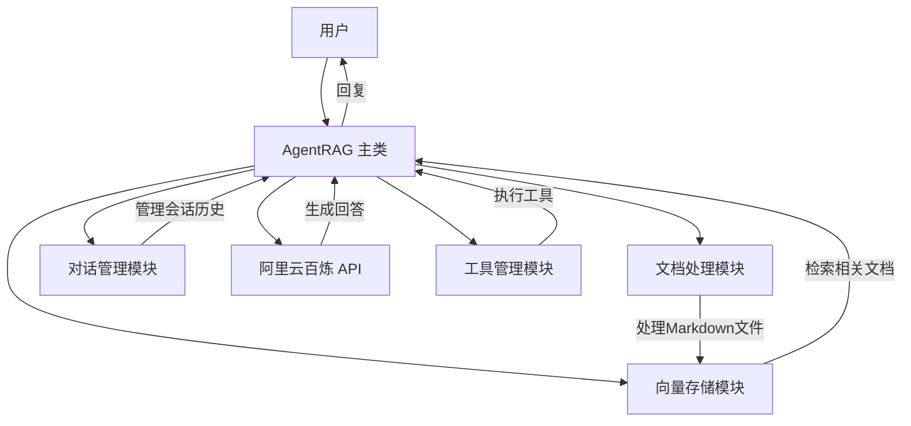
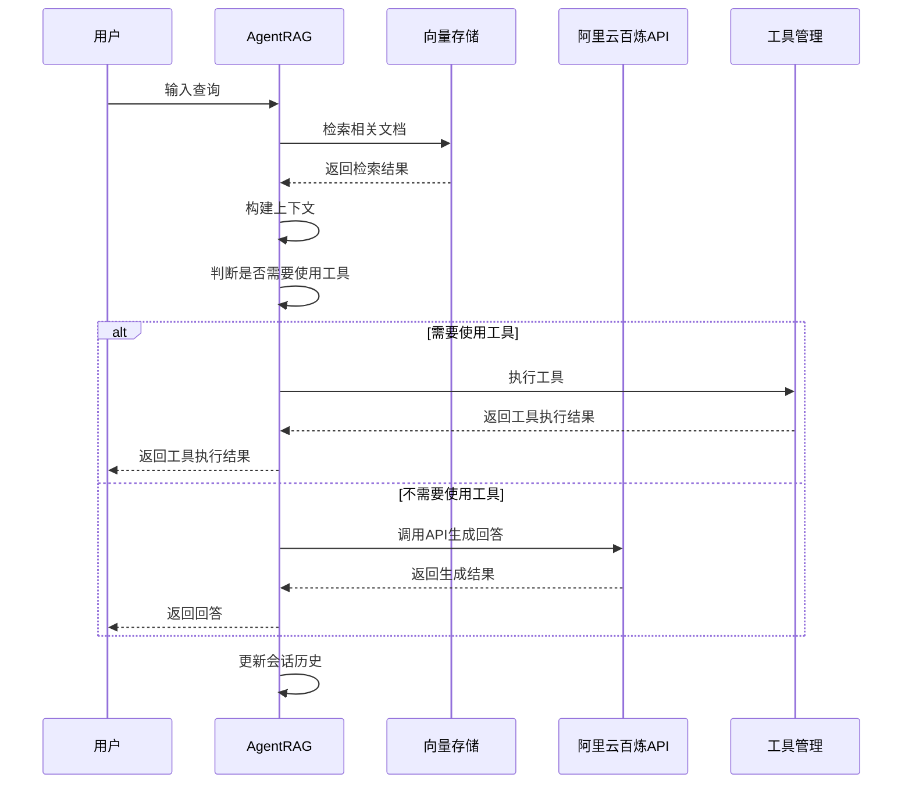

# 景明（Jingming） 游戏Agent系统 Code

## 1. 项目概览

景明Agnet系统是一个基于 LangChain 和阿里云百炼 API 的《星露谷物语》知识库聊天机器人系统，采用 RAG（Retrieval-Augmented Generation）技术，将 Markdown 文件转换为向量数据库，结合阿里云百炼 API 生成高质量的回答。

### 核心功能
- 自然语言理解与处理
- 知识库管理与检索
- 工具使用能力
- 会话记忆和学习
- 自主决策

### 技术栈
- **编程语言**：Python 3.8+
- **核心框架**：LangChain
- **向量存储**：FAISS（本地）
- **文本处理**：Markdown 解析器
- **API 服务**：阿里云百炼 API

## 2. 目录结构

```
agent-rag/
├── src/                   # 源代码
│   ├── api/                  # API 集成模块
│   ├── conversation/         # 对话管理模块
│   ├── document_processing/  # 文档处理模块
│   ├── tools/                # 工具使用模块
│   ├── vector_store/         # 向量存储模块
│   ├── utils/                # 工具函数
│   └── main.py               # 主入口
├── data/                  # 数据目录
│   ├── knowledge/           # 知识库文件
│   └── vector_db/           # 向量数据库
├── backend/               # 后端服务
├── frontend/              # 前端界面
├── docs/                  # 文档
├── requirements.txt       # 依赖声明
├── README.md              # 项目说明
└── 启动指南.md            # 启动指南
```

## 3. 系统架构

Agent RAG 系统采用模块化设计，各组件之间通过明确的接口进行交互。系统架构分为以下几个层次：

1. **用户交互层**：处理用户输入和系统输出
2. **核心处理层**：包括对话管理、工具调用和决策逻辑
3. **知识库层**：处理文档存储、向量化和检索
4. **API 集成层**：与阿里云百炼 API 交互

### 架构流程图



## 4. 核心模块

### 4.1 主入口模块 (main.py)

主入口模块 [main.py](file:///Users/xuyao/Documents/01_codes/Agent/agent-rag/src/main.py) 是系统的核心控制中心，负责初始化各模块并协调它们的工作。

**主要功能**：
- 初始化系统配置和环境变量
- 协调各模块的工作流程
- 处理用户查询并返回响应
- 管理会话状态

**核心流程**：
1. 加载环境变量和配置
2. 初始化各模块实例
3. 初始化向量存储（如果不存在）
4. 处理用户查询
5. 检索相关文档
6. 构建上下文
7. 生成回答
8. 管理会话历史

### 4.2 文档处理模块 (markdown_processor.py)

文档处理模块 [markdown_processor.py](file:///Users/xuyao/Documents/01_codes/Agent/agent-rag/src/document_processing/markdown_processor.py) 负责加载和处理 Markdown 文档。

**主要功能**：
- 加载知识库中的 Markdown 文件
- 将文档分割成合适的块
- 提取文档内容和元数据

### 4.3 向量存储模块 (vector_store.py)

向量存储模块 [vector_store.py](file:///Users/xuyao/Documents/01_codes/Agent/agent-rag/src/vector_store/vector_store.py) 负责管理向量数据库，包括文档向量化、存储和检索。

**主要功能**：
- 文档向量化
- 向量存储管理
- 相似性搜索
- 索引优化

### 4.4 对话管理模块 (conversation_manager.py)

对话管理模块 [conversation_manager.py](file:///Users/xuyao/Documents/01_codes/Agent/agent-rag/src/conversation/conversation_manager.py) 负责管理会话历史和构建上下文。

**主要功能**：
- 管理会话历史
- 构建上下文
- 提供会话记忆

### 4.5 API 集成模块 (bailian_api.py)

API 集成模块 [bailian_api.py](file:///Users/xuyao/Documents/01_codes/Agent/agent-rag/src/api/bailian_api.py) 负责与阿里云百炼 API 交互，生成回答。

**主要功能**：
- API 调用封装
- 模型参数配置
- 响应处理
- 错误处理

### 4.6 工具管理模块 (tool_manager.py)

工具管理模块 [tool_manager.py](file:///Users/xuyao/Documents/01_codes/Agent/agent-rag/src/tools/tool_manager.py) 负责管理和执行工具。

**主要功能**：
- 工具注册与管理
- 工具调用执行
- 结果处理

## 5. 关键类与函数

### 5.1 AgentRAG 类

**功能**：系统的核心类，协调各模块的工作。

**主要方法**：
- `__init__()`：初始化各模块和配置
- `_init_vector_store()`：初始化向量存储
- `process_query(query)`：处理用户查询
- `_should_use_tool(query)`：判断是否需要使用工具
- `_parse_tool_call(query)`：解析工具调用
- `clear_conversation()`：清空会话历史
- `add_document(file_path)`：添加文档到知识库

### 5.2 MarkdownProcessor 类

**功能**：处理 Markdown 文档。

**主要方法**：
- `load_documents()`：加载知识库中的 Markdown 文件
- `split_documents(documents, chunk_size, chunk_overlap)`：将文档分块
- `process(chunk_size, chunk_overlap)`：处理 Markdown 文件并返回分块

### 5.3 VectorStoreManager 类

**功能**：管理向量数据库。

**主要方法**：
- `create_vector_store(documents)`：创建向量存储
- `load_vector_store()`：加载向量存储
- `save_vector_store()`：保存向量存储
- `add_documents(documents)`：添加文档到向量存储
- `search(query, k)`：搜索相关文档

### 5.4 ConversationManager 类

**功能**：管理会话历史和构建上下文。

**主要方法**：
- `add_message(role, content)`：添加消息到会话历史
- `get_history()`：获取会话历史
- `get_history_str()`：获取会话历史字符串
- `clear_history()`：清空会话历史
- `get_context(query, retrieved_docs)`：构建上下文

### 5.5 BailianAPI 类

**功能**：与阿里云百炼 API 交互。

**主要方法**：
- `generate(prompt, model_name, temperature, max_tokens, system_message)`：调用 API 生成文本
- `generate_with_context(query, context, model_name, temperature, max_tokens)`：带上下文的文本生成

### 5.6 ToolManager 类

**功能**：管理和执行工具。

**主要方法**：
- `_register_default_tools()`：注册默认工具
- `add_tool(tool)`：添加自定义工具
- `get_tools()`：获取所有工具
- `search_web(query)`：搜索网络信息
- `calculate(expression)`：执行数学计算
- `run_tool(tool_name, input_text)`：运行指定工具
- `get_tool_descriptions()`：获取工具描述

## 6. 依赖关系

| 依赖包 | 版本 | 用途 | 来源 |
|--------|------|------|------|
| langchain | - | 核心框架 | [requirements.txt](file:///Users/xuyao/Documents/01_codes/Agent/agent-rag/requirements.txt) |
| langchain-core | - | 核心功能 | [requirements.txt](file:///Users/xuyao/Documents/01_codes/Agent/agent-rag/requirements.txt) |
| langchain-community | - | 社区集成 | [requirements.txt](file:///Users/xuyao/Documents/01_codes/Agent/agent-rag/requirements.txt) |
| faiss-cpu | - | 向量存储 | [requirements.txt](file:///Users/xuyao/Documents/01_codes/Agent/agent-rag/requirements.txt) |
| markdown | - | 文本处理 | [requirements.txt](file:///Users/xuyao/Documents/01_codes/Agent/agent-rag/requirements.txt) |
| requests | - | API 客户端 | [requirements.txt](file:///Users/xuyao/Documents/01_codes/Agent/agent-rag/requirements.txt) |
| python-dotenv | - | 环境变量管理 | [requirements.txt](file:///Users/xuyao/Documents/01_codes/Agent/agent-rag/requirements.txt) |
| tavily-python | - | 工具集成 | [requirements.txt](file:///Users/xuyao/Documents/01_codes/Agent/agent-rag/requirements.txt) |
| pytest | - | 测试 | [requirements.txt](file:///Users/xuyao/Documents/01_codes/Agent/agent-rag/requirements.txt) |
| black | - | 代码格式化 | [requirements.txt](file:///Users/xuyao/Documents/01_codes/Agent/agent-rag/requirements.txt) |
| flake8 | - | 代码检查 | [requirements.txt](file:///Users/xuyao/Documents/01_codes/Agent/agent-rag/requirements.txt) |
| isort | - | 导入排序 | [requirements.txt](file:///Users/xuyao/Documents/01_codes/Agent/agent-rag/requirements.txt) |

## 7. 配置与部署

### 7.1 配置文件

系统使用环境变量进行配置，需要在 `config/` 目录下创建 `.env` 文件，配置以下参数：

```env
# 阿里云百炼API配置
BAILIAN_API_KEY=your_api_key
BAILIAN_API_URL=your_api_url

# 向量存储配置
VECTOR_STORE_PATH=data/vector_db

# 知识库配置
KNOWLEDGE_BASE_PATH=data/knowledge

# 模型配置
MODEL_NAME=qwen-turbo

# 检索配置
TOP_K=5
CHUNK_SIZE=1000
CHUNK_OVERLAP=200
```

### 7.2 部署方式

#### 7.2.1 本地部署

1. 创建虚拟环境：
   ```bash
   python3 -m venv venv
   ```

2. 激活虚拟环境：
   ```bash
   # Windows: venv\Scripts\activate
   # macOS/Linux: source venv/bin/activate
   ```

3. 安装依赖：
   ```bash
   pip install -r requirements.txt
   ```

4. 启动系统：
   ```bash
   python src/main.py
   ```

#### 7.2.2 容器化部署

1. 构建镜像：
   ```bash
   docker build -t agent-rag .
   ```

2. 运行容器：
   ```bash
   docker run -p 8000:8000 agent-rag
   ```

## 8. 运行方式

### 8.1 命令行交互

系统启动后，会进入命令行交互模式，用户可以输入问题，系统会生成回答。

**交互命令**：
- 输入任意文本：向系统提问
- 输入"退出"：结束对话
- 输入"清空"：清空会话历史

### 8.2 处理流程

1. 用户输入问题
2. 系统检索相关文档
3. 构建上下文（包括检索结果和会话历史）
4. 判断是否需要使用工具
5. 如果需要使用工具，执行工具并返回结果
6. 如果不需要使用工具，调用阿里云百炼 API 生成回答
7. 将用户问题和系统回答添加到会话历史
8. 返回回答给用户

## 9. 扩展与维护

### 9.1 扩展功能

系统采用模块化设计，支持以下扩展：

- **添加新工具**：通过 `ToolManager.add_tool()` 方法添加自定义工具
- **集成其他语言模型**：修改 `BailianAPI` 类以支持其他模型
- **添加重排序功能**：在检索结果基础上添加重排序逻辑
- **支持更多文档格式**：扩展 `MarkdownProcessor` 类以支持其他格式

### 9.2 维护建议

- 定期优化向量存储，特别是当知识库增大时
- 调整提示词和参数以提高模型响应质量
- 添加错误处理和日志记录以提高系统稳定性
- 监控 API 调用频率，避免超过限制

## 10. 系统流程图



## 11. 代码示例

### 11.1 基本使用示例

```python
from src.main import AgentRAG

# 初始化系统
agent = AgentRAG()

# 处理查询
response = agent.process_query("星露谷是什么？")
print(response)

# 继续对话
response = agent.process_query("星露谷有哪些角色？")
print(response)

# 清空会话历史
agent.clear_conversation()
```

### 11.2 添加文档示例

```python
from src.main import AgentRAG

# 初始化系统
agent = AgentRAG()

# 添加新文档
agent.add_document("path/to/new_document.md")

# 处理查询
response = agent.process_query("新文档中的内容")
print(response)
```

## 12. 总结

景明Agent系统是一个功能完整的知识库聊天机器人系统，采用 RAG 技术结合阿里云百炼 API，提供高质量的问答服务。系统具有以下特点：

- 模块化设计，易于扩展和维护
- 支持知识库管理和检索
- 具备工具使用能力
- 提供会话记忆功能
- 支持多种部署方式

系统适用于需要基于知识库进行问答的场景，如客服、教育、信息查询等领域。通过扩展工具和集成其他模型，可以进一步增强系统的能力和适用范围。